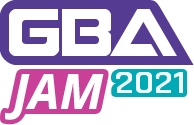

# 

The **GBA Jam 2021** was an homebrew competition hosted by [gbadev.net](https://gbadev.net) to celebrate the 20th anniversary of the Game Boy Advance. Contestants had 3 months (from April 10th 2021 at 12:00 AM to July 12th 2021 at 12:00 AM) to develop something new running on the GBA, using whatever tools they wanted.

The competition was hosted at [itch.io/jam/gbajam21](https://itch.io/jam/gbajam21).

To learn more about GBA development, visit [gbadev.net](https://gbadev.net) and join our [Discord](https://discord.io/gbadev).

This page collects every entry submitted, providing the final released ROMs and the sources.

## Downloads

- Full releases (contains screenshots, sources, ..): [gbajam21.zip](https://github.com/gbajam21/gbajam21.github.io/archive/refs/tags/final.zip)
- GBA ROMs only : [gbajam21_roms.zip](https://github.com/gbajam21/gbajam21.github.io/releases/download/final/gbajam21_roms.zip)

## Games

### Thanx GBA

&nbsp;  
by torte00  
[Project Page](https://torte00.itch.io/thanx-gba) |
[ROM File](https://gbajam21.github.io/entries/thanxgba/ThanxGBA.gba) |
[Release](https://github.com/gbajam21/gbajam21.github.io/tree/main/entries/thanxgba)

### Knight Owls

&nbsp;&nbsp;  
by blaise-rascal  
[Project Page](https://blaise-rascal.itch.io/knight-owls) |
[ROM File](https://gbajam21.github.io/entries/knight-owls/KnightOwls.gba) |
[Release](https://github.com/gbajam21/gbajam21.github.io/tree/main/entries/knight-owls)

### GBA MMO

&nbsp;  
by maciel310  
[Project Page](https://maciel310.itch.io/gba-mmo) |
[ROM File](https://gbajam21.github.io/entries/gba-mmo/gba-mmo.zip) |
[Release](https://github.com/gbajam21/gbajam21.github.io/tree/main/entries/gba-mmo)

### Feline

&nbsp;&nbsp;  
by foopod  
[Project Page](https://foopod.itch.io/feline) |
[ROM File](https://gbajam21.github.io/entries/feline/feline.gba) |
[Release](https://github.com/gbajam21/gbajam21.github.io/tree/main/entries/feline)

### GeBurtstAg

&nbsp;  
by zeichensystem  
[Project Page](https://zeichensystem.itch.io/geburtstag) |
[ROM File](https://gbajam21.github.io/entries/geburtstag/GeBurtstAg.gba) |
[Release](https://github.com/gbajam21/gbajam21.github.io/tree/main/entries/geburtstag)

### µCity Advance

&nbsp;&nbsp;  
by skylyrac  
[Project Page](https://skylyrac.itch.io/ucity-advance) |
[ROM File](https://gbajam21.github.io/entries/ucity-advance/ucity-advance-v1.0.1.gba) |
[Release](https://github.com/gbajam21/gbajam21.github.io/tree/main/entries/ucity-advance)

### Nuthouse

&nbsp;&nbsp;  
by Gregor M. Cameron  
[Project Page](https://gregor-m-cameron.itch.io/nuthouse) |
[ROM File](https://gbajam21.github.io/entries/nuthouse/nuthouse.gba) |
[Release](https://github.com/gbajam21/gbajam21.github.io/tree/main/entries/nuthouse)

### SS6PlayerForGBA

&nbsp;  
by laqieer  
[Project Page](https://laqieer.itch.io/ss6playerforgba) |
[ROM File](https://gbajam21.github.io/entries/ss6player/character_sample1.gba) |
[Release](https://github.com/gbajam21/gbajam21.github.io/tree/main/entries/ss6player)

### Bridge quest

&nbsp;  
by fixxiefixx  
[Project Page](https://fixxiefixx.itch.io/bridge-quest) |
[ROM File](https://gbajam21.github.io/entries/bridge-quest/gba_dev_jam_2021.gba) |
[Release](https://github.com/gbajam21/gbajam21.github.io/tree/main/entries/bridge-quest)

### Advance! [Early Demo] Adventures Of The Math & Logic Club

&nbsp;&nbsp;  
by kva64  
[Project Page](https://kva64.itch.io/advance-demo-adventures-of-the-math-logic-club) |
[ROM File](https://gbajam21.github.io/entries/advance-adventures/advance_demo.gba) |
[Release](https://github.com/gbajam21/gbajam21.github.io/tree/main/entries/advance-adventures)

### Varooom 3D

&nbsp;&nbsp;  
by GValiente, tempest, Kaappis  
[Project Page](https://gvaliente.itch.io/varooom-3d) |
[ROM File (high audio quality)](https://gbajam21.github.io/entries/varooom-3d/varooom-3d.gba) |
[ROM File (SuperCard SD compatible)](https://gbajam21.github.io/entries/varooom-3d/varooom-3d_slow.gba) |
[Release](https://github.com/gbajam21/gbajam21.github.io/tree/main/entries/varooom-3d)

### Dungeon Advance

&nbsp;&nbsp;  
by phi1997  
[Project Page](https://phi1997.itch.io/dungeon-advance) |
[ROM File](https://gbajam21.github.io/entries/dungeon-advance/DungeonAdvance.gba) |
[Release](https://github.com/gbajam21/gbajam21.github.io/tree/main/entries/dungeon-advance)

### Reaper GBA Demake

&nbsp;&nbsp;  
by Greatheart Games  
[Project Page](https://greatheart-games.itch.io/reaper-gba-demake) |
[ROM File](https://gbajam21.github.io/entries/reaper-gba-demake/Reaper.gba) |
[Release](https://github.com/gbajam21/gbajam21.github.io/tree/main/entries/reaper-gba-demake)

### Ghost Train

by brave_orakio  
[Project Page](https://brave-orakio.itch.io/ghost-train) |
[ROM File](https://gbajam21.github.io/entries/ghost-train/testingtheengine.gba) |
[Release](https://github.com/gbajam21/gbajam21.github.io/tree/main/entries/ghost-train)

### MeteoRain

&nbsp;&nbsp;  
by Dr. Ludos  
[Project Page](https://drludos.itch.io/meteorain-gba-jam-2021) |
[ROM File](https://gbajam21.github.io/entries/meteorain/MeteoRain.gba) |
[Release](https://github.com/gbajam21/gbajam21.github.io/tree/main/entries/meteorain)

### Otamatone GBA

&nbsp;  
by AtsushiHdez  
[Project Page](https://atsushihdez.itch.io/otamatonegba) |
[ROM File](https://gbajam21.github.io/entries/otamatone/OtamatoneGBA.gba) |
[Release](https://github.com/gbajam21/gbajam21.github.io/tree/main/entries/otamatone)

### Stick Kicker

&nbsp;  
by samfromcadott  
[Project Page](https://samfromcadott.itch.io/stick-kicker) |
[ROM File](https://gbajam21.github.io/entries/stick-kicker/stick-kicker.gba) |
[Release](https://github.com/gbajam21/gbajam21.github.io/tree/main/entries/stick-kicker)

### Where is the ball

&nbsp;  
by kevin20012  
[Project Page](https://kevin20012.itch.io/where-is-the-ball) |
[ROM File](https://gbajam21.github.io/entries/where-is-the-ball/WhereIsTheBall.gba) |
[Release](https://github.com/gbajam21/gbajam21.github.io/tree/main/entries/where-is-the-ball)

### Jayro's GBA™ VIDEO Test Cartridge v1.0

&nbsp;&nbsp;  
by JayroJones  
[Project Page](https://jayrojones.itch.io/jayros-gba-video-test-cartridge) |
[ROM File](https://gbajam21.github.io/entries/gba-video-test/Jayro's GBA VIDEO Test Cartridge v1.0.gba) |
[Release](https://github.com/gbajam21/gbajam21.github.io/tree/main/entries/gba-video-test)

### gba-remote-play demo

&nbsp;  
by [r]labs  
[Project Page](https://r-labs.itch.io/gba-remote-play) |
- [ROM File](https://gbajam21.github.io/entries/gba-remote-play/sender-and-receiver.gba)
- [Release](https://github.com/gbajam21/gbajam21.github.io/tree/main/entries/gba-remote-play)

### Necropolis

&nbsp;  
by jehoz  
[Project Page](https://jehoz.itch.io/necropolis) |
[ROM File](https://gbajam21.github.io/entries/necropolis/necropolis.gba) |
[Release](https://github.com/gbajam21/gbajam21.github.io/tree/main/entries/necropolis)

### Fountain

&nbsp;&nbsp;  
by xhyi  
[Project Page](https://xhyi.itch.io/fountain) |
[ROM File](https://gbajam21.github.io/entries/fountain/Fountain2.gba) |
[Release](https://github.com/gbajam21/gbajam21.github.io/tree/main/entries/fountain)

### One line draw

by Liang Guangyu  
[Project Page](https://liang-guangyu.itch.io/one-line-draw) |
[ROM File](https://gbajam21.github.io/entries/one-line-draw/One_Line_Drawing.gba) |
[Release](https://github.com/gbajam21/gbajam21.github.io/tree/main/entries/one-line-draw)

### Solar Guard

&nbsp;&nbsp;  
by Deft Spade  
[Project Page](https://deft-spade.itch.io/solar-guard) |
[ROM File](https://gbajam21.github.io/entries/solar-guard/Solar_Guard_GBA_JAM_2021.gba) |
[Release](https://github.com/gbajam21/gbajam21.github.io/tree/main/entries/solar-guard)

### Sawyer's Stories: Time for The Chickens to go to Sleep

&nbsp;&nbsp;  
by Chukoloco08  
[Project Page](https://sawyer-ique.itch.io/sawyers-stories-time-for-the-chickens-to-go-to-sleep) |
[ROM File](https://gbajam21.github.io/entries/sawyer-stories/TimeForTheChickensToGoToSleep.gba) |
[Release](https://github.com/gbajam21/gbajam21.github.io/tree/main/entries/sawyer-stories)

### xniq

&nbsp;&nbsp;  
by exelotl, PyroPyro, hot_pengu  
[Project Page](https://exelotl.itch.io/xniq) |
[ROM File](https://gbajam21.github.io/entries/xniq/xniq-alpha.gba) |
[Release](https://github.com/gbajam21/gbajam21.github.io/tree/main/entries/xniq)

### Tigermoth

&nbsp;&nbsp;  
by pmprog  
[Project Page](https://pmprog.itch.io/tigermoth) |
[ROM File](https://gbajam21.github.io/entries/tigermoth/tigermoth-20210617-beta2.gba) |
[Release](https://github.com/gbajam21/gbajam21.github.io/tree/main/entries/tigermoth)

### Firemania

&nbsp;  
by ipatix  
[Project Page](https://ipatix.itch.io/firemania) |
[ROM File](https://gbajam21.github.io/entries/firemania/firemania.gba) |
[Release](https://github.com/gbajam21/gbajam21.github.io/tree/main/entries/firemania)

### Skyland

&nbsp;  
by evanbowman  
[Project Page](https://evanbowman.itch.io/skyland) |
[ROM File](https://gbajam21.github.io/entries/skyland/Skyland.gba) |
[Release](https://github.com/gbajam21/gbajam21.github.io/tree/main/entries/skyland)

### Inheritors of the Oubliette

&nbsp;&nbsp;  
by Mahou Shoujo ☆ Magical Moestar, one60hp  
[Project Page](https://mahoushoujomagicalmoestar.itch.io/inheritors-of-the-oubliette) |
[ROM File](https://gbajam21.github.io/entries/inheritors-of-the-oubliette/inheritors-of-the-oubliette.gba) |
[Release](https://github.com/gbajam21/gbajam21.github.io/tree/main/entries/inheritors-of-the-oubliette)

### Wrong Road GBA

&nbsp;&nbsp;  
by jenswa  
[Project Page](https://jenswa.itch.io/wrong-road-gba) |
[ROM File](https://gbajam21.github.io/entries/wrong-road-gba/wrong-road_mb.gba) |
[Release](https://github.com/gbajam21/gbajam21.github.io/tree/main/entries/wrong-road-gba)

### Symbol★Merged

&nbsp;  
by copyrat90  
[Project Page](https://copyrat90.itch.io/sym-merged) |
[ROM File](https://gbajam21.github.io/entries/symbol-merged/sym_merged.gba) |
[Release](https://github.com/gbajam21/gbajam21.github.io/tree/main/entries/symbol-merged)

### libsavgba

&nbsp;  
by laqieer  
[Project Page](https://laqieer.itch.io/libsavgba) |
[ROM File](https://gbajam21.github.io/entries/libsavgba/detect-save-type.gba) |
[Release](https://github.com/gbajam21/gbajam21.github.io/tree/main/entries/libsavgba)

### PipeSpin

&nbsp;&nbsp;  
by hippydave  
[Project Page](https://hippydave.itch.io/pipespin) |
[ROM File](https://gbajam21.github.io/entries/pipespin/PipeSpin.gba) |
[Release](https://github.com/gbajam21/gbajam21.github.io/tree/main/entries/pipespin)

### 587 Squadron Advance

&nbsp;&nbsp;  
by PogeSoft  
[Project Page](https://pogesoft.itch.io/587-squadron-advance) |
[ROM File](https://gbajam21.github.io/entries/squadron-advance/587SQN.gba) |
[Release](https://github.com/gbajam21/gbajam21.github.io/tree/main/entries/squadron-advance)

### Toadally Awesome Game 

&nbsp;&nbsp;  
by squishyfrogs  
[Project Page](https://squishyfrogs.itch.io/toadally-awesome) |
[ROM File](https://gbajam21.github.io/entries/toadally-awesome/Toadally-Awesome-(Jam-Build)-[Unlocked].gba) |
[Release](https://github.com/gbajam21/gbajam21.github.io/tree/main/entries/toadally-awesome)

### Individuation

&nbsp;  
by K'miinik  
[Project Page](https://kmiinik.itch.io/individuation) |
[ROM File](https://gbajam21.github.io/entries/individuation/individuation.gba) |
[Release](https://github.com/gbajam21/gbajam21.github.io/tree/main/entries/individuation)

### SASSAFRAS THE GAME

&nbsp;&nbsp;  
by screv69  
[Project Page](https://screv69.itch.io/sassafras-the-game) |
[ROM File](https://gbajam21.github.io/entries/sassafras-the-game/STG2.0.gba) |
[Release](https://github.com/gbajam21/gbajam21.github.io/tree/main/entries/sassafras-the-game)

### GBA DVD Bounce

&nbsp;  
by Hpmason  
[Project Page](https://hpmason.itch.io/gba-dvd-bounce) |
[ROM File](https://gbajam21.github.io/entries/gba-dvd-bounce/gba-dvd.gba) |
[Release](https://github.com/gbajam21/gbajam21.github.io/tree/main/entries/gba-dvd-bounce)

### GoldenGBA

&nbsp;&nbsp;  
by 3DSage  
[Project Page](https://3dsage.itch.io/goldengba) |
[ROM File](https://gbajam21.github.io/entries/goldengba/GoldenGBA_v1.gba) |
[Release](https://github.com/gbajam21/gbajam21.github.io/tree/main/entries/goldengba)

### Quantum Survival

&nbsp;  
by LarkSkwared  
[Project Page](https://larkskwared.itch.io/quantum-sruvival) |
[ROM File](https://gbajam21.github.io/entries/quantum-survival/Quantum_survival.gba) |
[Release](https://github.com/gbajam21/gbajam21.github.io/tree/main/entries/quantum-survival)

### Covid Adventure

&nbsp;  
by klomp  
[Project Page](https://klomp.itch.io/covid-adventure) |
[ROM File](https://gbajam21.github.io/entries/covid-adventure/covid-adventure_gba-jam-2021.gba) |
[Release](https://github.com/gbajam21/gbajam21.github.io/tree/main/entries/covid-adventure)

### Legend of holy sword

&nbsp;&nbsp;  
by Liang Guangyu  
[Project Page](https://liang-guangyu.itch.io/legend-of-holy-sword) |
[ROM File](https://gbajam21.github.io/entries/legend-of-holy-sword/yxjm(2).gba) |
[Release](https://github.com/gbajam21/gbajam21.github.io/tree/main/entries/legend-of-holy-sword)

### Untitled Volleyball Game [Early Prototype]

&nbsp;  
by Stormplay Games, Sharkhat  
[Project Page](https://stormplay.itch.io/untitled-volleyball-game) |
[ROM File](https://gbajam21.github.io/entries/volleyball/Volleyball.gba) |
[Release](https://github.com/gbajam21/gbajam21.github.io/tree/main/entries/volleyball)

## Results

The entries are still being judged by the jury. Check back later.
